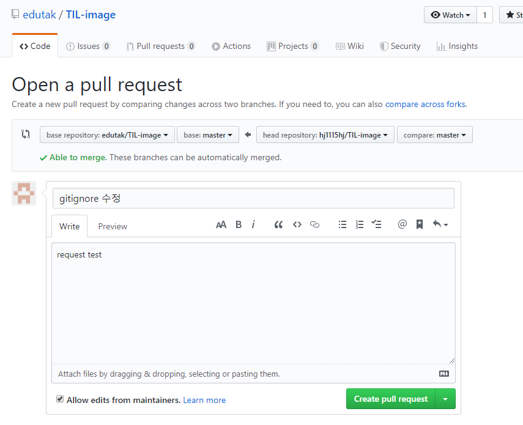

 # Pull Request

> 상대방의 레파지토리를 clone한후 수정한다음 pull request를 요청해서 수정된 내용을 상대방의 원격 레파지토리에  저장 시 킬수 있다.
>
> 

변경된 내용을 push한다고 상대방의 원격 디렉토리 내용이 변하는 것이 아니다! 나의 즉 바뀌는 것은 나의 원격디렉토리의 내용이다.

아래는 push 한후의 결과이다.

```bash
student@M50413 MINGW64 ~/Desktop/gittest/TIL-image/git (master)
$ git push origin master
Enumerating objects: 13, done.
Counting objects: 100% (13/13), done.
Delta compression using up to 12 threads
Compressing objects: 100% (9/9), done.
Writing objects: 100% (10/10), 72.94 KiB | 24.31 MiB/s, done.
Total 10 (delta 2), reused 0 (delta 0)
remote: Resolving deltas: 100% (2/2), completed with 2 local objects.
To https://github.com/hj1115hj/TIL-image.git
   c77327f..7199240  master -> master

student@M50413 MINGW64 ~/Desktop/gittest/TIL-image/git (master)
$ git log
commit 719924002aabc52e46bc6f1b9e24e1b41866596d (HEAD -> master, origin/master, origin/HEAD)
Author: hj1115hj <hyejin_one@naver.com>
Date:   Thu Dec 26 18:40:53 2019 +0900

    gitignore 수정

```

다음과 같이 상대방의 repository에서 pull request를 요청해 볼 수 는 있다.

