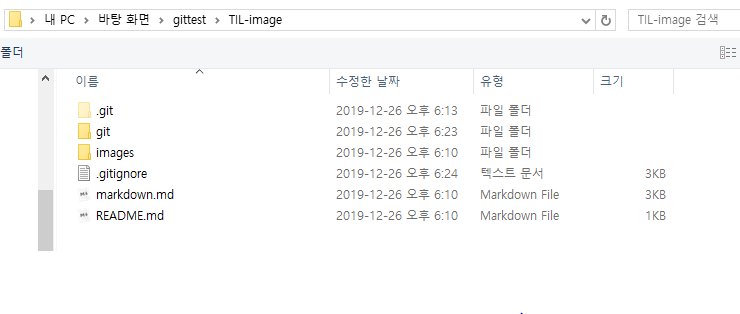
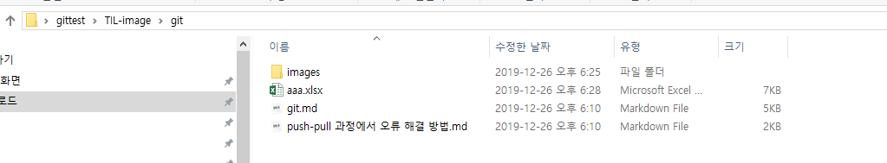
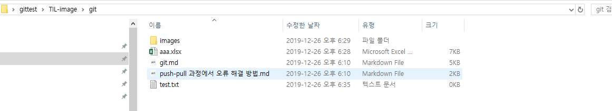

# gitignore

> git 저장소에서 관리하고 싶지 않은 파일을 설정할 수 있다.

`.gitignore` 파일을 생성하여 아래와 같이 설정할 수 있다.

```bash
*.xlsx # 특정 확장자 모두
secrets/ # 특정 폴더 내 모두
a.txt # 특정 파일
```

초반에는 일반적으로 개발 환경에서 자주 설정하는 내용은 [gitignore.io](https://gitignore.io) 에서 가져오는 것을 추천한다.

아래의 검색창이 git이 ignore할 프로그램을 검색한다.


* `python` , `windows`, `jupyternotebook`

```
# Created by https://www.gitignore.io/api/python,windows,jupyternotebooks
# Edit at https://www.gitignore.io/?templates=python,windows,jupyternotebooks

### JupyterNotebooks ###
# gitignore template for Jupyter Notebooks
# website: http://jupyter.org/

.ipynb_checkpoints
*/.ipynb_checkpoints/*

# IPython
profile_default/
ipython_config.py

# Remove previous ipynb_checkpoints
#   git rm -r .ipynb_checkpoints/

### Python ###
# Byte-compiled / optimized / DLL files
__pycache__/
*.py[cod]
*$py.class

# C extensions
*.so

# Distribution / packaging
.Python
build/
develop-eggs/
dist/
downloads/
eggs/
.eggs/
lib/
lib64/
parts/
sdist/
var/
wheels/
pip-wheel-metadata/
share/python-wheels/
*.egg-info/
.installed.cfg
*.egg
MANIFEST

# PyInstaller
#  Usually these files are written by a python script from a template
#  before PyInstaller builds the exe, so as to inject date/other infos into it.
*.manifest
*.spec

# Installer logs
pip-log.txt
pip-delete-this-directory.txt

# Unit test / coverage reports
htmlcov/
.tox/
.nox/
.coverage
.coverage.*
.cache
nosetests.xml
coverage.xml
*.cover
.hypothesis/
.pytest_cache/

# Translations
*.mo
*.pot

# Scrapy stuff:
.scrapy

# Sphinx documentation
docs/_build/

# PyBuilder
target/

# pyenv
.python-version

# pipenv
#   According to pypa/pipenv#598, it is recommended to include Pipfile.lock in version control.
#   However, in case of collaboration, if having platform-specific dependencies or dependencies
#   having no cross-platform support, pipenv may install dependencies that don't work, or not
#   install all needed dependencies.
#Pipfile.lock

# celery beat schedule file
celerybeat-schedule

# SageMath parsed files
*.sage.py

# Spyder project settings
.spyderproject
.spyproject

# Rope project settings
.ropeproject

# Mr Developer
.mr.developer.cfg
.project
.pydevproject

# mkdocs documentation
/site

# mypy
.mypy_cache/
.dmypy.json
dmypy.json

# Pyre type checker
.pyre/

### Windows ###
# Windows thumbnail cache files
Thumbs.db
Thumbs.db:encryptable
ehthumbs.db
ehthumbs_vista.db

# Dump file
*.stackdump

# Folder config file
[Dd]esktop.ini

# Recycle Bin used on file shares
$RECYCLE.BIN/

# Windows Installer files
*.cab
*.msi
*.msix
*.msm
*.msp

# Windows shortcuts
*.lnk

# End of https://www.gitignore.io/api/python,windows,jupyternotebooks
```

> visualstudio code를 설치 한다.

[vsc](https://code.visualstudio.com/)에서 다운로드 한 후 File>OpenForder에서 .git이 저장되어있는 폴더를 선택한다.

위에 코드를 gitignore 파일을 만들어서 복사 붙여넣기 한다.

위치는 다음과 같다 



### gitignore Test

아래 위치에 ingore할 파일 aaa.xlsx을 생성 한다



gitignore 파일에 aaa.xlsx 입력후 저장한다. 이후 git status 를 입력하게 되면 아래와 같은 결과가 나오게 되는대 commit하지 않은 목록에 aaa.xlsx가 나타나지 않는 것을 확인 할수 있다.

```bash
$ git status 
On branch master
Your branch is up to date with 'origin/master'.

Changes not staged for commit:
  (use "git add/rm <file>..." to update what will be committed)
  (use "git restore <file>..." to discard changes in working directory)
        modified:   ../.gitignore
        deleted:    gitignore.md

#commit 하지 않은 목록에 나타나지 않는다! 
Untracked files:
  (use "git add <file>..." to include in what will be committed)
        images/


```


반대로 아래와 같이 test.txt 파일 생성후 git  status 명령을 입력하면 test.txt가 commit하지 않은 목록으로 나타나는 것을 확 인 할 수 있다.




```bash
$ git status
On branch master
Your branch is up to date with 'origin/master'.

Changes not staged for commit:
  (use "git add/rm <file>..." to update what will be committed)
  (use "git restore <file>..." to discard changes in working directory)
        modified:   ../.gitignore
        deleted:    gitignore.md

Untracked files:
# commit 하지 않은 목록에 test.txt 파일이 나타났다
  (use "git add <file>..." to include in what will be committed)
        images/
        test.txt

no changes added to commit (use "git add" and/or "git commit -a")

```

